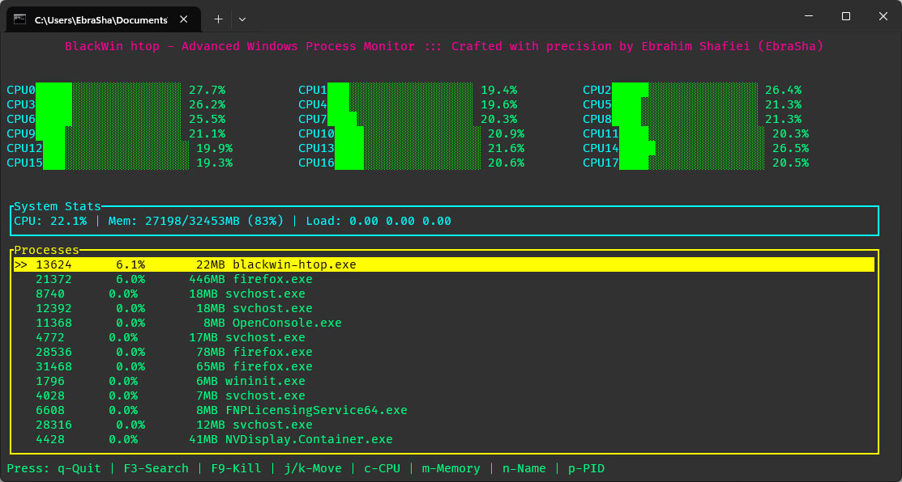

# راهنمای کاربر BlackWin htop
<div align="center">
  
</div>


<div dir="rtl">


## 🎤 ترجمه اطلاعات نرم افزار
- [English](README.md)
- [فارسی](README.fa.md)


## نمای کلی
ابزار htop را به ویندوز بیاورید – یک ابزار مانیتورینگ سیستم مبتنی بر زبان برنامه‌نویسی Rust برای توسعه‌دهندگان و کاربران حرفه‌ای در سیستم‌عامل‌های ویندوز و لینوکس.
BlackWin htop یک ابزار پایشگر سیستم با طراحی گرافیکی ترمینالی و الهام‌گرفته از سبک سایبرپانک است که اطلاعات بلادرنگ و دقیق از عملکرد سیستم را در اختیار شما قرار می‌دهد.
با رابط کاربری ترمینال زیبای آن، می‌توانید به‌صورت مؤثر میزان استفاده از پردازنده (CPU)، مصرف حافظه (RAM) و همچنین فرآیندهای فعال سیستم را مشاهده و مدیریت کنید.
## ویژگی‌ها

### نظارت سیستم
- نظارت لحظه‌ای استفاده از CPU برای هر هسته
- آمار استفاده از حافظه
- مدیریت فرآیندها با قابلیت مرتب‌سازی و فیلتر کردن
- رابط کاربری زیبا با تم سایبرپانک

### ویژگی‌های کلیدی
- نظارت بر هر هسته CPU به صورت جداگانه
- لیست فرآیندها با اطلاعات دقیق
- قابلیت جستجوی فرآیندها
- قابلیت خاتمه فرآیندها
- پیگیری مصرف حافظه
- تم رنگی سایبرپانک

## نصب

### ویندوز
1. دانلود آخرین نسخه از GitHub
2. استخراج فایل zip
3. اجرای `blackwin-htop.exe`

### ساخت از سورس
1. نصب Rust:
   ```bash
   curl --proto '=https' --tlsv1.2 -sSf https://sh.rustup.rs | sh
   ```
2. کلون و ساخت:
   ```bash
   git clone https://github.com/ebrasha/blackwin-htop.git
   cd BlackWin/BlackWin\ htop
   cargo build --release
   ```
3. اجرا:
   ```bash
   cargo run --release
   ```

## نحوه استفاده

### ناوبری پایه
- استفاده از `↑/↓` یا `j/k` برای حرکت در لیست فرآیندها
- فشردن `q` برای خروج از برنامه
- فشردن `F3` برای جستجوی فرآیندها
- فشردن `F9` برای خاتمه فرآیند انتخاب شده

### مدیریت فرآیندها
- مرتب‌سازی فرآیندها با:
  - `p`: شناسه فرآیند
  - `n`: نام فرآیند
  - `c`: مصرف CPU
  - `m`: مصرف حافظه
- جستجوی فرآیندها:
  1. فشردن `F3` برای ورود به حالت جستجو
  2. تایپ نام فرآیند
  3. فشردن `Enter` برای تأیید یا `Esc` برای لغو

### نمایش اطلاعات
- استفاده از CPU با نوارهای رنگی نمایش داده می‌شود:
  - سبز: استفاده کم (0-50%)
  - نارنجی: استفاده متوسط (50-80%)
  - قرمز: استفاده زیاد (80-100%)
- اطلاعات حافظه نمایش می‌دهد:
  - کل حافظه
  - حافظه استفاده شده
  - درصد استفاده

## عیب‌یابی

### مشکلات رایج

1. **برنامه اجرا نمی‌شود**
   - اطمینان از داشتن دسترسی مدیر
   - بررسی عدم مسدود شدن توسط آنتی‌ویروس
   - بررسی تنظیمات Windows Defender

2. **مصرف بالای CPU**
   - افزایش فاصله به‌روزرسانی
   - بستن برنامه‌های پرمصرف دیگر
   - بررسی بار سیستم

3. **مشکلات نمایش**
   - اطمینان از پشتیبانی یونیکد در ترمینال
   - بررسی پشتیبانی رنگ ترمینال
   - بررسی کافی بودن اندازه ترمینال

### پیام‌های خطا

- "خطا در دریافت اطلاعات سیستم":
  - اجرا به عنوان مدیر
  - بررسی مجوزهای سیستم

- "عدم امکان خاتمه فرآیند":
  - بررسی داشتن مجوزهای کافی
  - فرآیند ممکن است توسط سیستم محافظت شود

## پشتیبانی

### دریافت کمک
- مشکلات GitHub: [BlackWin Issues](https://github.com/ebrasha/blackwin-htop/issues)
- ایمیل: Prof.Shafiei@Gmail.com

### گزارش اشکالات
هنگام گزارش اشکالات، لطفاً موارد زیر را شامل کنید:
1. نسخه سیستم عامل
2. مراحل تکرار مشکل
3. رفتار مورد انتظار در مقابل رفتار واقعی
4. پیام‌های خطا (در صورت وجود)
5. تصاویر (در صورت امکان)

## سؤالات متداول

**س: چرا BlackWin htop استفاده CPU متفاوتی نسبت به Task Manager نشان می‌دهد؟**
ج: ابزارهای مختلف ممکن است از روش‌های متفاوتی برای محاسبه استفاده CPU استفاده کنند. BlackWin htop بر هسته‌های فیزیکی برای نمایش دقیق‌تر تمرکز می‌کند.

**س: آیا می‌توانم رنگ‌ها را سفارشی کنم؟**
ج: در حال حاضر، تم سایبرپانک ثابت است، اما سفارشی‌سازی تم برای نسخه‌های آینده برنامه‌ریزی شده است.

**س: آیا بر عملکرد سیستم تأثیر می‌گذارد؟**
ج: BlackWin htop برای سبک و کارآمد بودن طراحی شده است و تأثیر حداقلی بر منابع سیستم دارد.

**س: چرا نمی‌توانم همه فرآیندها را ببینم؟**
ج: برخی فرآیندها ممکن است به دسترسی مدیر نیاز داشته باشند. برنامه را به عنوان مدیر اجرا کنید.

## نکات و ترفندها

1. **ناوبری کارآمد**
   - استفاده از `Home/End` برای پرش به ابتدا/انتهای لیست
   - استفاده از `PageUp/PageDown` برای پیمایش سریع‌تر

2. **مدیریت فرآیندها**
   - مرتب‌سازی بر اساس مصرف CPU برای شناسایی فرآیندهای پرمصرف
   - استفاده از جستجو برای یافتن سریع فرآیندهای خاص

3. **نظارت بر عملکرد**
   - نظارت بر هسته‌های CPU به صورت جداگانه برای درک بهتر
   - بررسی روند مصرف حافظه در طول زمان

## به‌روزرسانی‌ها و ارتقاها

### بررسی به‌روزرسانی‌ها
1. بازدید از مخزن GitHub
2. بررسی صفحه انتشارها
3. دانلود و نصب آخرین نسخه

### فرآیند به‌روزرسانی
1. بستن نمونه فعلی
2. دانلود نسخه جدید
3. جایگزینی فایل اجرایی قدیمی
4. اجرای نسخه جدید

## نکات امنیتی

- همیشه دانلودها را از منابع رسمی تأیید کنید
- هنگام خاتمه فرآیندهای ناشناخته محتاط باشید
- با مجوزهای مناسب اجرا کنید
- برنامه را به‌روز نگه دارید


## ❤️ حمایت مالی
اگر این پروژه برای شما مفید بود و مایل به حمایت از توسعه بیشتر هستید، لطفاً در نظر داشته باشید که کمک مالی کنید:
- [اینجا اهدا کنید](https://alphajet.ir/abdal-donation)

## 🤵 برنامه‌نویس
ساخته شده با عشق توسط **ابراهیم شفیعی (EbraSha)**
- **ایمیل**: Prof.Shafiei@Gmail.com
- **تلگرام**: [@ProfShafiei](https://t.me/ProfShafiei)

## 📜 مجوز
این پروژه تحت مجوز GPLv2 or later منتشر شده است.

</div> 